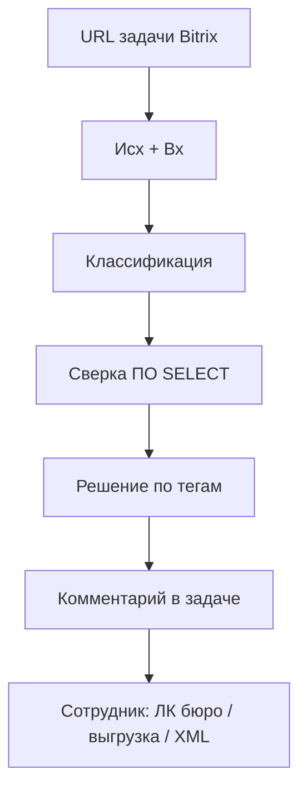

# Порядок репозитория и конвейер решения оспаривания

Цель продукта: по URL задачи агент наполняет чат так, чтобы сотрудник мог исполнить (выгрузка, файл удаления, XML, ЛК бюро), не разбирая пакет с нуля.

Сейчас это не конвейер, а набор артефактов. Уже работает только классификация ([.cursor/skills/classify-osparivanie/SKILL.md](.cursor/skills/classify-osparivanie/SKILL.md)). Полный проход (ПО + решение + `@answer`) один раз сделали ad-hoc в задаче 494505: SQL через `sqlcmd` на `s-po-dev`, потому что MSSQL MCP в этом воркспейсе не подключён.




Жёсткий контур первой волны (подтверждён): комментарий = классификация + карточка ПО + решение + черновик `@answer` + стопы. Не делать: DML в ПО, файл в бюро, закрытие задачи, автоотправка клиенту.

---

## Что сломано сейчас

**Нет входа для агента.** Нет корневого README / `AGENTS.md` / `CONTEXT.md`. Агент не знает, что «решить» = алгоритм из [guide/00-obshiy-algoritm.md](guide/00-obshiy-algoritm.md), а не только теги.

**Два источника правды расходятся.**

- [classification.md](classification.md) — типы/подтипы и пакет НБКИ (Исх+весь Вх); смешанный = все теги.
- [complex-cases/taxonomy.md](complex-cases/taxonomy.md) — «резать mixed на два контура», «на буткемпе тег уже есть».
- [type.md](type.md) — короткий дубль тех же тегов.

SoT для меток: `classification.md`. Таксономия должна на него ссылаться, не спорить.

**Знания не подключены к скиллу.** [guide/](guide/) — рабочий план сотрудника; [complex-cases/](complex-cases/) — карточки ОЧ/ТЧ/Б/ЗС и эталоны. Скилл классификации их не читает. Скилла решения нет.

**Мусор и битые ссылки.**

- Дубли: `zz-subtypes.csv`, `och-tch-classes.csv` в корне и в `complex-cases/`.
- `osparivanie-2026-tasks — копия.csv`.
- `osparivanie-2026-comments.csv` указан в README сложных кейсов, файла нет.
- `guide/README.md` ссылается на `docs/*.docx` и SQL ответов — папки `docs/` в репозитории нет.
- Скрипты `download_task_pdfs.py` / `ocr_task_pdfs.py` / `create_test_tasks.py` с хардкодом `C:\repos\bki` — сбор корпуса, не решение.
- Скилл пишет MCP `user-bitrix24`, фактически namespace `user-bitrix24-test`.

**Дыра в сверке ПО.** Запросы есть в [guide/09-sql.md](guide/09-sql.md), но в воркспейсе нет MSSQL MCP (он в `E:\repos\mcp-ms-sql`). Без SELECT конвейер останавливается после классификации.

---

## Фаза 0 — порядок (один смысл — одно место)

Целевая раскладка:

- [CONTEXT.md](CONTEXT.md) — глоссарий (оспаривание, тип/подтип, смешанный пакет, Исх/Вх, ПО, бюро, УИД, `keyPart`/`keyDZ`, выгрузка 3.1/3.2, ОфОтв / ОфОтв_Пр). Без SQL и без «как делать».
- [AGENTS.md](AGENTS.md) — карта: цель = решить задачу комментарием; классификация → `classification.md` + скилл; решение → `guide/00-obshiy-algoritm.md` + новый скилл; SQL только SELECT из `guide/09-sql.md`; DML/бюро/закрытие — человек.
- [README.md](README.md) — то же для человека, коротко.
- `guide/` — единственный операционный план (шаги).
- `classification.md` — единственный справочник типов/подтипов.
- `complex-cases/` — эталоны, аналоги, карточки решений; не дублировать определения типов.
- `research/` (или `corpus/`) — CSV выгрузки, `miteng.md`, python-сборщики, сырые json. Не на пути агента.

Правки содержимого в этой фазе:

- `taxonomy.md` и `type.md` — ссылка на `classification.md`, убрать противоречие про mixed.
- Скилл классификации: namespace `user-bitrix24-test`, не копировать правила типов.
- Удалить дубли CSV и «копию»; в `.gitignore` — копии и локальные PDF (`task-pdfs` уже игнорируется).
- Битые ссылки на `docs/` и comments CSV — починить или явно пометить «вне репо».

Не переписывать гайды и не трогать золотой набор ОЧ, пока не закрыт вход.

---

## Фаза 1 — скилл «решить оспаривание»

Новый скилл [.cursor/skills/solve-osparivanie/SKILL.md](.cursor/skills/solve-osparivanie/SKILL.md), model-invoked: URL задачи + «реши» / «сверка» / «оспаривание».

Шаги (каждый с критерием done), без копирования гайдов внутрь скилла:

1. Вложения Исх/Вх — тот же съём, что у классификации (локальный `DOWNLOAD_URL`, не MCP-хост).
2. Классификация по `classification.md` (те же шаги, что classify; если комментарий «Классификация» уже есть — не плодить второй, обновить).
3. Сверка ПО: SELECT из `guide/09-sql.md` (клиент → УИД/`UuidBegin` → титул/график/запросы/подпись по тегам). Только чтение. Нет SQL MCP → `sqlcmd` на тот же `s-po-dev` / `cz_newCP`, как в 494505; если и это недоступно — стоп с готовыми запросами в чат, без выдуманных фактов ПО.
4. Решение по [guide/00-obshiy-algoritm.md](guide/00-obshiy-algoritm.md) и файлу типа (`02-och` … `06-zs`). Смешанный пакет — все контуры, один комментарий, два адресата — два черновика `@org`.
5. Комментарий BBCode в задачу (как classify: `task.commentitem.add` / `im.message.update`).

Каркас комментария:

```
[B]Классификация[/B] …
[B]ПО[/B] keyPart / keyDZ / УИД / факты сверки
[B]Решение[/B] по каждому контуру (подтвердить / выгрузка / эскалация) + стоп
[B]Черновик @answer[/B] по пунктам письма
[B]Осталось человеку[/B] ЛК бюро, файл удаления, XML, теги ОфОтв
```

Стоп-условия из гайда: нет клиента/договора в ПО → эскалация, не отказ; финал не предлагать, пока выгрузка/удаление/demerge не подтверждены; заявку с подписью не исключать; 3.1 не открывать, если ПО уже как в заявлении.

Подключить MSSQL MCP в `.cursor/mcp.json` этого репо (read-only, как в mcp-ms-sql) — отдельный шаг окружения, без него фаза 1 деградирует до sqlcmd.

Классификация остаётся отдельным скиллом: короткий прогон «только теги».

---

## Фаза 2 — глубина по типам (после живого прогона фазы 1)

Не новый продукт, а указатели из скилла решения:

- **ЗЗ** (~54%): [guide/04-zz.md](guide/04-zz.md) — запросы удалять всегда; заявка → договор/`Podpis=-1` не исключать.
- **ОЧ** (~26%): правила R1–R6 из [complex-cases/och-card.md](complex-cases/och-card.md); [och-gold-set.json](complex-cases/och-gold-set.json) как регрессия формулировок, не как поиск похожих.
- **ТЧ / Б / ЗС**: карточки из [assist-facts.md](complex-cases/assist-facts.md), без автозакрытия; ЗС — [zs-playbook.md](complex-cases/zs-playbook.md).

ЛК трёх бюро в комментарии помечать `unknown`, пока сотрудник не сверит. Не имитировать сверку бюро из ПО.

---

## Вне скоупа сейчас

- Автомат файла удаления запросов и XML «Ответы на оспаривания» (можно следующей волной).
- OCR/парсер пакета НБКИ как отдельный сервис — агент читает txt целиком.
- DML в Partner / выгрузки 13/21/23.
- Отдельный AI-продукт вне задачи Bitrix.

