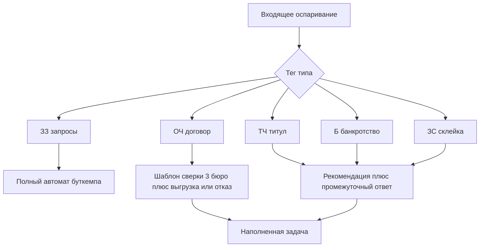

# План работ: ОЧ + ТЧ/Б/ЗС

Исходники: [miteng.md](miteng.md), [osparivanie-2026-tasks.csv](osparivanie-2026-tasks.csv) (2131 задача, янв–сен 2026), [osparivanie-2026-comments.csv](osparivanie-2026-comments.csv) (24352 сообщений, 14876 человеческих).

Типы в тегах **взаимно исключающие**. Это и есть рабочая таксономия:

- **ЗЗ** 1149 (54%) — запросы КИ. Буткемп / 80%-автомат. Сюда не входим.
- **ОЧ** 553 (26%) — основная часть: договор, просрочка, закрытие, продажа в ПКО. Вторая волна шаблонов.
- **ТЧ** 287 (13.5%) — титульная часть: паспорт, адрес, ФИО, место рождения.
- **Б** 101 (4.7%) — банкротство.
- **ЗС** 41 (1.9%) — склейка/разделение субъектов (demerge).
- **запрос ССП** 7 — подтип ЗЗ, не этот трек.

ТЧ+Б+ЗС = **20.1%** объёма. На встрече «сложными» назвали проверку кредита; по корпусу ОЧ ближе к ЗЗ (короткие шаблонные сверки), а тяжёлый хвост — ТЧ/Б/ЗС.

## Что видно в комментариях

**ОЧ — повторяемый протокол.** Сотрудник поднимает договор в ПО, сверяет НБКИ / Эквифакс / ОКБ, пишет одну из формул: «отображается корректно» / «отправил корректировку №…» / «продан в ПКО». Медиана цикла 8.8 дня, как у ЗЗ. Проект ответа (ПрОтв) только у 6%. Типовые ветки: договор открыт и есть просрочка; договор закрыт не во всех бюро; продажа в ПКО; пересечение с банкротством (часть ОЧ помечена не тегом Б).

**ТЧ — настоящий assistive.** В 2 раза больше комментариев, чем у ЗЗ (12.1 vs 5.4 на задачу). ПрОтв у 43%, 6+ у 70%, 10+ у 39%, медиана 16.8 дня. В чатах: сверка паспорта/адреса/ФИО между письмом, ПО и бюро; «данные старые / уже правили в связанной задаче»; SQL-правки Partner; массовые выгрузки; **промежуточный ответ**, пока бюро не подтвердило; склейка двух клиентов по паспорту.

**Б — правовая сверка, не парсинг.** Дата банкротства vs просрочка; «проценты стоп, дни просрочки могут капать»; статус в таблице Bankrot vs договор «Прекращен»; корректировка, если прекращение процедуры не ушло в бюро.

**ЗС — редкий, дорогой.** Файл на разделение, `demerge@nbki.ru`, чистка старых паспортов в `Partner_OldPasp`, связанные задачи «уже правили». ПрОтв 39%, много промежуточных.

Общий конвейер ответа (все типы): вложение → «готовь ответ» (часто Дарья / Александр / Анастасия) → официальный ответ. Автоотправки клиенту до подтверждения бюро в корпусе нет — это запрет и для этого трека.

Ограничение выгрузки: ~294 задачи с мигрированным чатом («Чтобы прочитать комментарии…») — старые комментарии неполные. Вложения — только Disk ID (~12029 файлов), самих PDF в CSV нет.

## Волна A — ОЧ как шаблоны (не AI)

Цель: сотрудник не сверяет три бюро руками, если факты однозначны.

1. **Карточка договора в задаче.** Из файла/письма: ФИО, UID/ПД, номер договора. Из ПО: статус, даты, просрочка, ПКО, банкротство. По каждому бюро: открыт / закрыт / продан / банкрот / нет записи.
2. **Правила решения** (явные, не промпт):
  - Все три бюро = ПО → черновик «отображается корректно», можно готовить ответ.
  - Расхождение по закрытию/продаже → черновик корректировочной выгрузки + стоп «не отвечать, пока выгрузка не принята».
  - Банкротство есть, тег ОЧ (не Б) → не шаблонить; эскалация в контур Б.
  - Клиента/договора нет в ПО → эскалация, не отказ.
3. **Библиотека из корпуса.** Нарезать 30–40 эталонных ОЧ-тредов: корректно / корректировка / ПКО / просрочка. Это не поиск «похожих», а регрессионный набор правил.
4. **Демо ОЧ.** Кейс «закрыт в ПО, в ОКБ закрытия нет» → задача с таблицей 3 бюро и кнопкой «черновик выгрузки». Кейс «везде корректно» → черновик отказа в оспаривании.

Не делать в волне A: SQL в ПО, массовые номера выгрузок, автоотправку в бюро.

## Волна B — ТЧ/Б/ЗС как assistive AI

Цель: не закрыть кейс, а собрать факты, категорию, аналоги и чеклист. Сотрудник подтверждает.

1. **Классификатор поверх тегов.** На буткемпе тег уже есть. Для новых входящих — признаки из файла/темы: паспорт/адрес/ФИО → ТЧ; банкрот/реализация → Б; склейка/два СКИ/разделение → ЗС; иначе не этот контур. Низкий confidence → «не уверен».
2. **Карточка фактов по типу** (то, что люди уже пишут руками):

- ТЧ: паспорт/адрес/ФИО/место рождения в письме vs ПО vs 3 бюро; связанные задачи на ту же ПД; «фото нового паспорта есть/нет»; нужен ли промежуточный ответ.
- Б: дата признания, просрочка до/после, Bankrot vs статус договора, ПКО, что уже ушло выгрузкой.
- ЗС: два keyPart / два ФИО на один паспорт; что уже demerge-или; в какое бюро письмо на разделение.

1. **Поиск аналогов.** Индекс завершённых задач с человеческими комментариями (1859 задач). Для ТЧ — по типу расхождения (паспорт vs адрес vs склейка), не по ФИО. Для Б — по ветке (корректно по закону / правили Bankrot / продажа+банкрот). Для ЗС — мало эталонов (41), держать как ручной playbook, не модель.
2. **Рекомендация в задаче:** категория, факты, 1–3 аналога, черновик следующего шага, стоп-условия («не отвечать до бюро», «нужен промежуточный», «уже правили в задаче N»). Guardrail: модель не предлагает SQL и не выбирает сторону, если факты расходятся.
3. **Промежуточный ответ как сущность.** Для ТЧ/ЗС завести статус «ждём бюро», не держать это только тегом ОфОтв_Пр (36 штук, из них 29 ТЧ — сигнал, что процесс уже есть, но дырявый).
4. **Демо 20%.** Три сценарных заглушки из корпуса: ТЧ «индекс не совпадает, адреса из письма нет в КИ»; Б «банкрот 31.01, просрочка только до этой даты»; ЗС «два клиента, один паспорт, файл на разделение». Система не закрывает, эскалирует.

## Общее с 80%-треком (не дублировать)

Парсинг вложений, OCR, UID/поиск клиента, постановка задачи, почтовый контур «ответ бюро» — общие. Расхождение с ЗЗ начинается после классификации. Сервис рекомендации живёт **в задаче**, отдельный AI-продукт не плодить.

Связанность письмо ↔ задача ↔ выгрузка ↔ ответ бюро для ТЧ/Б критичнее, чем для ЗЗ: цикл длиннее, часто две итерации с бюро.

## Данные, без которых план не едет

- SYSTEM: 15–20 пакетов файлов на тип (ОЧ / ТЧ / Б / ЗС), не только ЗЗ. Смешанные «запросы + кредит» в тегах почти не пересекаются — в выгрузке mixed нет, их искать отдельно, как просили на встрече.
- Выгрузка истории уже есть; для аналогов нужны **тексты до миграции чата** и сами вложения (Disk ID в CSV, файлов нет).
- Статистика ценности: ОЧ 26% потока при коротком цикле; ТЧ+Б+ЗС 20% потока и ~35% человеческих комментариев (3477+910+395 из 14876). Это цифра для демо, не «доля удаления запросов».

## Что не делать

- Не автоматизировать ТЧ/Б/ЗС «как удаление запросов».
- Не отправлять ответ клиенту до бюро.
- Не считать ОЧ тем самым 20% AI: сначала правила сверки 3 бюро.
- Не учить модель на системных сообщениях и плейсхолдерах `[файл]`.
- Не трогать SQL-операции в ПО (в ТЧ/ЗС их пишут в чат) — только флаг «нужна правка карточки клиента».

## Критерии готовности

**Буткемп:** классификатор не сваливает ТЧ/Б/ЗС в авто-ЗЗ; по ОЧ видна таблица 3 бюро и шаблон; по одному ТЧ и одному Б — рекомендация + эскалация; промежуточный ответ назван, не скрыт.

**После:** правила ОЧ на живом потоке; аналоги ТЧ/Б из истории; ЗС как чеклист; метрика «сотрудник не открывал PDF, принял карточку».